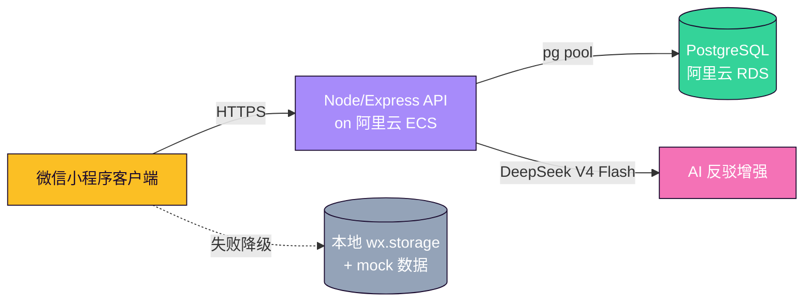

# LeBron 詹黑逻辑拆解器

[](https://github.com/clavelinaswykoniki-cell/LeBron/actions/workflows/ci.yml)
[](LICENSE)
[](scripts/)
[](miniprogram/data/)

> 微信小程序全栈作品。把评论区常见的 LeBron 詹黑话术拆解成结构化反驳卡，配套段位对战 / 排行榜 / 每日签到 / AI 增强反驳 / 分享卡片等娱乐组件。

**v2.6** · 215 张反驳卡 · 730 条别名 · 46 类争议分类 · 紫金湖人主题
**全栈架构**：小程序前端 + Node/Express 后端 + PostgreSQL on 阿里云 RDS + DeepSeek V4 AI 增强

---

## 🎯 架构（v2.6 全栈版本）



**API 端点**：
- `GET /api/leaderboard` — PK 段位排行
- `POST /api/pk/submit` — 对战结果 + 段位分变化（事务）
- `POST /api/daily/checkin` — 每日签到 + streak 累计
- `POST /api/llm/enhance` — DeepSeek 代理（key 永不出现在前端）
- `GET /health` / `GET /api/llm/health` — 健康检查

**双路径策略**：每个网络调用都有本地兜底，离线/网络差时用户体验是"网络慢"而非"崩了"。

---

## 30 秒了解

打开小程序 → 输入"8分释兵权"或者点首页热梗 → 出反驳卡 → 一键复制怼回评论区。

附带功能：
- 🏆 **段位 / 勋章系统**：阅读 / 复制累计解锁 5 段位 + 6 勋章（青铜詹蜜 → 王者詹皇）
- 🧠 **球迷测试 H5**：5 题判断你是几级詹蜜（中性化打分，可分享结果）
- 👑 **23 号秘藏**：长按 hero 球衣触发彩蛋（生涯里程碑墙）
- 🛡️ **隐私页**：合规说明，本地存储，零数据收集
- 📢 **复制反馈**：震动 + Toast + 金光特效

---

## 跑通

```bash
git clone <repo-url>
cd lebron-rebuttal-miniapp
npm install
```

1. 打开**微信开发者工具**
2. 导入 `lebron-rebuttal-miniapp` 目录
3. AppID 选**测试号**
4. 编译 → 模拟器或真机预览即可

---

## 技术栈

| 层 | 内容 |
|---|---|
| 客户端 | 微信小程序原生（无 Taro / uni-app） |
| UI | [TDesign Mini-Program](https://tdesign.tencent.com/miniprogram) v1.14 |
| 客户端状态 | Page 内 `data` + `wx.setStorageSync`（段位 / 勋章 / 历史） |
| 后端 | Node.js 18 + Express + `pg` driver |
| 数据库 | PostgreSQL 18（阿里云 RDS） |
| AI 增强 | DeepSeek V4 Flash（通过自家后端代理，key 不出现在前端） |
| 部署 | 阿里云 ECS（Node + Nginx + PM2 + Let's Encrypt HTTPS） |
| 测试 | Node.js 脚本（syntax / match / corpus / fallback / progression / safety / feedback / matchquery） + curl smoke 脚本 |
| CI | GitHub Actions（每次 push/PR 自动跑测试矩阵） |

---

## 数据规模

| 指标 | 数量 |
|---|---|
| 反驳卡 | **215 张**（base 100 + docx 50 + v2.1 新增 5 + 球星对比 20 + v2.4-2.5 新增 40） |
| 别名 / 短梗 | **730 条** |
| 争议分类 | **46 类** |
| 段位 | 5 档（青铜詹蜜 / 白银 / 黄金 / 钻石 / 王者詹皇） |
| 黑点素材库 | **10 张深度拆解**（`docs/raw-perspectives/`） + 扩展 JSON（events/data/causes/background/analysis）|
| 已实现页面 | **12 个**（index / result / about / easter / quiz / privacy / history / favorites / onboarding / leaderboard / pk / daily）|
| 后端表 | 4 张（users / leaderboard / match_records / checkins） |
| 后端 API | 5 个（leaderboard / pk/submit / daily/checkin / llm/enhance / health） |
| 自动化测试 | **8 个前端 + curl smoke 9 步**（含 GitHub Actions CI）|

---

## 功能列表

### v1.0 核心
- ✅ 黑点别名匹配 + fallback 通用反驳
- ✅ 30+ 类细分分类
- ✅ 4 种回复模式：短刀 / 封口 / 长拆 / 口播
- ✅ 一键复制 + 整张复制 + 全部复制
- ✅ 分类筛选 + 随机一条
- ✅ AI 增强（可选，需 CloudBase + DeepSeek Key）
- ✅ 模糊匹配 + 黑称识别

### v2.0 娱乐 + 完善
- ✅ **复制反馈包**：震动 + 金光特效 + Toast 三合一（`utils/feedback.js`）
- ✅ **段位 / 勋章系统**：5 段位 + 6 勋章，本地持久化（`utils/progression.js`）
- ✅ **球迷测试 H5**：5 题中性化测试 → "X 级詹蜜 / 中立观察者 / X 级詹黑" 结果（`pages/quiz/`）
- ✅ **23 号秘藏**：长按首页球衣触发，里程碑 + 巨型水印（`pages/easter/`）
- ✅ **关于页**：段位墙 + 勋章墙 + 数据看板（`pages/about/`）
- ✅ **隐私政策页**：5 段标准模板（`pages/privacy/`）
- ✅ **错误兜底**：复制失败 / 空 query / 跳转失败 Toast（`utils/safety.js`）

### v2.1 工程深化 + 内容扩展 + 分发就绪
- ✅ **GitHub Actions CI**：每次 push / PR 自动跑 5 个测试（matrix: node 18, 20）
- ✅ **OSS 仪式三件套**：LICENSE / CONTRIBUTING / CHANGELOG
- ✅ **3 个新单元测试**：test-safety / test-feedback / test-matchquery（共 20 个 assertions）
- ✅ **扩展卡 JSON**：10 张深度素材卡 events/data/causes/background/analysis（`data/rebuttal_cards_extended.js`）
- ✅ **5 张新黑点卡**：泡泡冠军 / 21 后湖人 / 没招牌动作 / 总决赛胜率 / G7 表现
- ✅ **20 张球星深度对比卡**：Curry / Durant / Jokic / Giannis / Wembanyama / Tatum
- ✅ **搜索历史 + 收藏页**：localStorage 持久化（`pages/{history,favorites}/`）
- ✅ **分享卡片生成**：长按结果卡 → wx.canvas 生成精美卡图 → 保存相册
- ✅ **首页 onboarding**：第一次打开 4 步引导（`pages/onboarding/`）
- ✅ **分发包**：LANDING_PAGE.html + PRESS_KIT.md + ROADMAP.md

---

## 跑测试

**前端**：
```bash
npm run check:syntax    # 静态检查 + UI 契约
npm run test:match      # 50 个高频黑点 → 命中卡匹配验证
npm run test:corpus     # 语料完整性 + 别名数 + review_needed 校验
npm run test:ai-fallback # AI enhance 三态：missing / failure / success
npm run test:progression # progression.js 单元测试
npm run test:safety     # safety.js 单元测试
npm run test:feedback   # feedback.js 单元测试
npm run test:matchquery # matchQuery.js 单元测试
```

**后端**：
```bash
cd server
npm run test:connect    # RDS 连接 + 表存在性验证
./test-api.sh           # 9 步 curl 回归（不烧 DeepSeek token）
./test-api.sh --include-llm  # 跑真实 DeepSeek 联调（消耗 token）
```

GitHub Actions CI 在每次 push / PR 自动跑前端测试。

---

## 测试词（可以直接搜）

```
8分 / 米奇冠军 / 科比五冠 / Excel球王 / 老张跑路 / 摊皇不回防
库里改变篮球 / LeGM / 基石冠军 / 没有得分王 / 乔丹6-0 / 宇宙勇
联盟保送 / 历史第二十 / 文班未来超詹 / 乔丹没抢七 / 科比一人一城
库里全票MVP / 邓肯低调 / 杜兰特单挑 / 约基奇组织
```

---

## 文件结构

```
miniprogram/
├── pages/
│   ├── index/           # 首页：搜索 / 卡片 / 段位浮条 / 菜单
│   ├── about/           # 关于页：段位 + 勋章墙 + 数据看板
│   ├── quiz/            # 球迷测试 5 题 H5
│   ├── easter/          # 23 号秘藏（长按 hero 触发）
│   └── privacy/         # 隐私政策
├── utils/
│   ├── matchQuery.js     # 本地匹配 + fallback
│   ├── normalizeQuery.js # 用户输入归一化
│   ├── llmProvider.js    # CloudBase 调用封装
│   ├── promptBuilder.js  # AI prompt 组装
│   ├── feedback.js       # v2.0 触感反馈
│   ├── progression.js    # v2.0 段位 / 勋章
│   └── safety.js         # v2.0 安全包装
├── data/
│   ├── arsenal.js        # 统一数据入口
│   ├── rebuttal_cards*.js # 反驳卡 (3 文件)
│   ├── aliases*.js        # 别名映射 (3 文件)
│   ├── categories.js      # 分类定义
│   └── ...
└── app.json              # 5 页面注册

docs/
├── context-compact.md    # 给 AI 的项目上下文
├── raw-perspectives/     # 黑点素材库（10 卡 + 工作流 doc）
├── superpowers/plans/    # 实施 plan 历史
├── SCREENSHOT_GUIDE.md   # 截图指南（v2.0）
└── DEMO_SCRIPT.md        # 30 秒演示稿（v2.0）

cloudfunctions/
└── generateReply/        # CloudBase 云函数（可选 AI 增强）

scripts/
├── test-match.js
├── test-corpus-integrity.js
├── test-ai-enhance-fallback.js
├── test-ui-contract.js
├── test-progression.js   # v2.0 单测
└── convert-docx-corpus.js
```

---

## 项目约束

- ❌ **不接 CloudBase / 数据库**（除非显式启用 AI 增强）
- ❌ **不提交真实 API key**（仅在 CloudBase 环境变量 `DEEPSEEK_API_KEY`）
- ❌ **黑称只做 alias 匹配**，不主动输出辱骂内容
- ✅ **本地兜底优先**，AI 增强失败必须 fallback 到本地卡
- ✅ **微信审核合规**：无敏感词主动 CTA，无敏感内容，篮球讨论性质

---

## 截图

> 截图位（用微信开发者工具截后放 `docs/screenshots/`，README 引用相对路径）。
> 截图清单见 [SCREENSHOT_GUIDE.md](./docs/SCREENSHOT_GUIDE.md)。

| 截图 | 位置 |
|---|---|
| 首页 hero + 卡片 | `docs/screenshots/01-home.png` |
| 段位 + 勋章墙 | `docs/screenshots/02-about.png` |
| 23 号彩蛋 | `docs/screenshots/03-easter.png` |
| 球迷测试 | `docs/screenshots/04-quiz.png` |
| 隐私页 | `docs/screenshots/05-privacy.png` |

---

## 项目目标 / 免责

练手项目 + 作品集。所有篮球观点仅为娱乐讨论，不代表 NBA 官方立场，不构成对任何球员的人身攻击。

License: MIT
