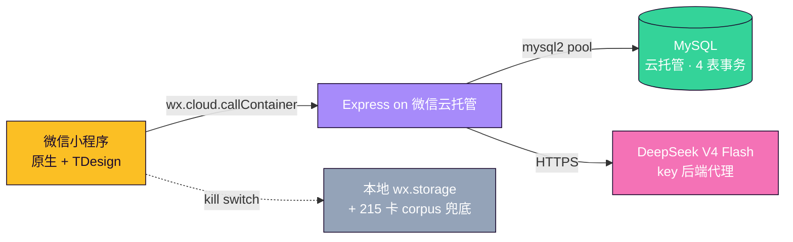

# LeBron 论点拆解器

[](https://github.com/clavelinaswykoniki-cell/LeBron/actions/workflows/ci.yml)
[](LICENSE)

> 微信小程序 · 把评论区 NBA 论点拆解成结构化反驳卡，配段位 PK + DeepSeek 增强反驳。

**v2.10.1** · 215 反驳卡 · 730 别名 · 46 类争议 · 14 页面 · 小程序 + Express + MySQL + DeepSeek 全栈

---

## 核心功能

- **黑点匹配**：输入「8 分释兵权」→ 自动定位 2011 总决赛 G4 数据卡，配双标揭穿话术
- **4 种回复模式**：短刀 / 封口 / 长拆 / 口播 — 一键复制怼回评论区
- **AI 增强反驳**：DeepSeek V4 Flash 处理模糊输入；网络/上游失败永远 fallback 到本地卡
- **段位 PK 系统**：青铜詹蜜 → 王者詹皇 5 阶段位 + 每日签到 streak + 云端实时排行
- **分享图生成**：长按结果卡 → `wx.canvas` 出湖人金主题图，相册保存可二次分发

---

## 架构



- **`wx.cloud.callContainer` 直连云托管**：绕开微信对正式域名的 ICP 备案 + HTTPS 白名单要求；开发/单测可降级 `wx.request`
- **API key 永不出前端**：DeepSeek key、MySQL 密码全部锁在云托管环境变量，前端只看到自家 `/api/llm/enhance`
- **任何网络调用都有本地兜底**：用户感知是「网络慢」而非「崩了」；完全离线也能用 215 张本地卡

---

## 技术亮点

**1. Prompt 工程 + 对抗测试套件**
`scripts/test-prompt-adversarial.js` 离线覆盖 10 类攻击面：prompt injection / 角色覆写 / 篮球包装非篮球话题 / 模板化金句 / 极端长短输入 / 主动黑别人引导，dry-run 不烧 DeepSeek token。<!-- VERIFY: HANDOFF 提到的「v2.8.5 6 轮迭代」具体迭代日志在仓库里没找到证据，明天 review -->

**2. 双模式 API 调度（`miniprogram/utils/api.js`）**
`wx.cloud.callContainer` 优先 + `wx.request` HTTPS fallback，`BASE_URL` 通过 `wx.storage` 做远程 kill switch（线上可一键切回本地 mock），5s 超时统一，Node 单测无 `wx` 对象也能跑（`scripts/test-api-cloud.js`）。

**3. 段位 enum 前后端契约**
5 阶段位 `bronze/silver/gold/diamond/king` 阈值 `0/200/500/1000/1800` 在 `utils/duel.js`、`utils/progression.js`、`server/db.js`、`server/sql/001_init.sql` 4 处必须一致，配 `.claude/skills/rank-tier-sync` 一键核对，改一处就触发提醒。

---

## 项目结构

```
miniprogram/        # 小程序前端：14 页面 + TDesign，215 张本地卡 + 730 别名
├── pages/          # index / result / pk / leaderboard / daily / chat / meme / quiz ...
├── utils/          # matchQuery / api / duel / progression / promptBuilder / safety
└── data/           # 反驳卡 + 别名 + 分类 + 扩展素材

server/             # 后端：Express + mysql2 pool，5 endpoints，4 张 MySQL 表
├── routes/         # leaderboard / pk / daily / llm / chat
├── sql/001_init.sql  # 幂等 schema + seed（CREATE TABLE IF NOT EXISTS）
└── test-api.sh     # curl smoke：9 步基础回归 + 可选 DeepSeek 联调

scripts/            # 12 个离线测试（语料 / 匹配 / UI 契约 / 对抗 prompt / cloud-mode）
docs/               # context-compact.md（AI 上下文）+ raw-perspectives（黑点素材）
```

---

## 本地开发

```bash
git clone https://github.com/clavelinaswykoniki-cell/LeBron.git && cd LeBron
npm install && cd server && npm install && cd ..

# core smoke tests
npm run check:syntax && npm run test:corpus

# 后端 MySQL 连接：先填 server/.env 的 MYSQL_* 再跑
cd server && npm run test:connect

# 用微信开发者工具导入仓库根目录，AppID 选测试号即可调试
```

完整测试矩阵见 `package.json#scripts`：`test:match` / `test:safety` / `test:feedback` / `test:progression` / `test:prompt` / `test:api-cloud` / `test:duel`，GitHub Actions 在每次 push / PR 自动跑。

历史版本演进见 [`CHANGELOG.md`](./CHANGELOG.md)。

> 项目状态：v2.10.1 已提交微信小程序审核（提交时间 2026-05-20，预计 1-3 天）。

---

## License

MIT
